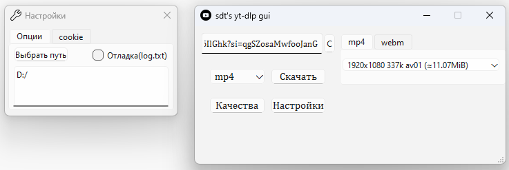

# yt-dlp-gui
[yt-dlp](https://github.com/yt-dlp/yt-dlp) gui project on [QT6](https://www.qt.io/) using [ffmpeg](https://ffmpeg.org/)

Поддерживаемые языки: русский

# Примечание

- Если программа вылетает после нажатия на кнопки скачать/поделиться, то скорее всего проблема в куки-файлах,
которые обязательны для некоторых видео и могут быть неправильно извлечены из браузера.

- [Выгружать куки из браузеров на хромиуме через --cookies-from-browser не выходит](https://github.com/yt-dlp/yt-dlp/issues/10927),
 поэтому стоит скачать Firefox и выбрать его во вкладке cookie в настройках.

- На данный момент(Версия 1.1) недоступно скачивание плейлистов.

# Интерфейс

